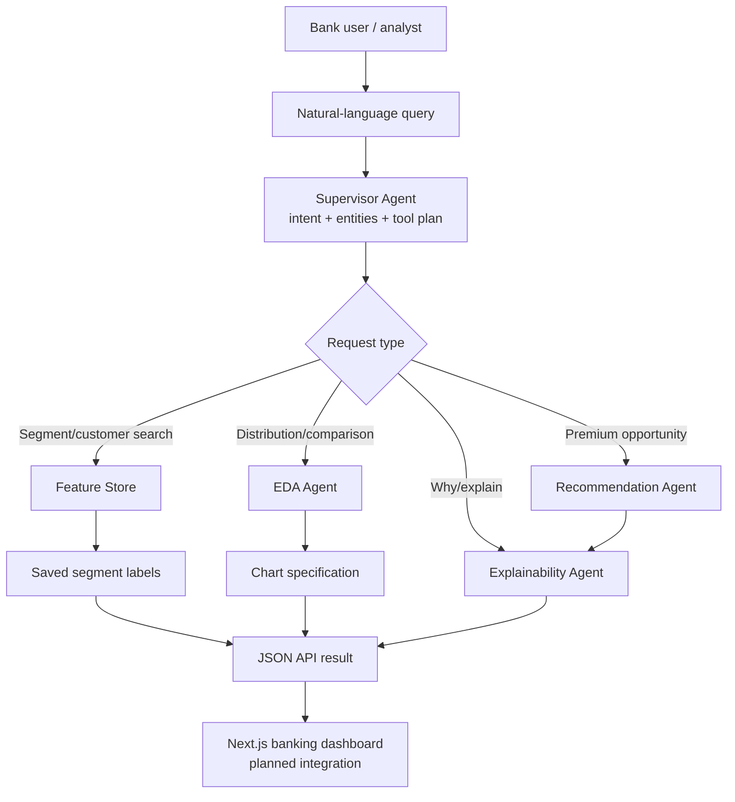
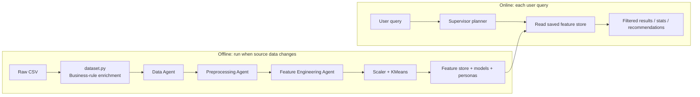
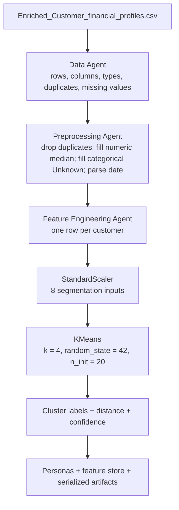
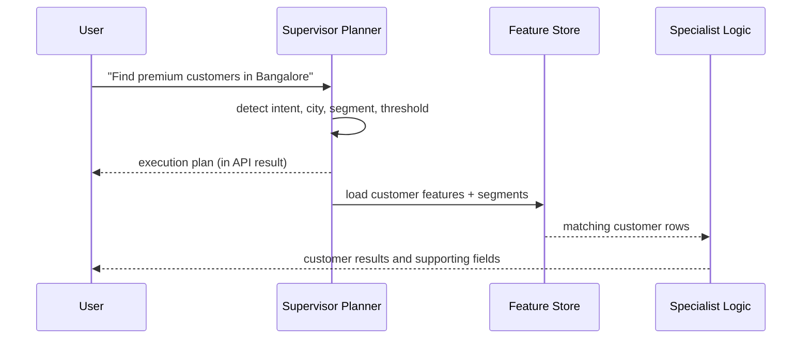
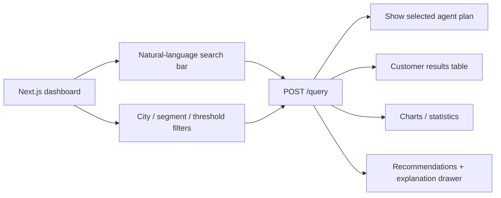

# Bank360 AI — Product Requirements & Execution Guide

**Project:** NoCode-NoCry — Société Générale Retail Banking Hackathon  
**Product name:** Bank360 AI: Customer Segmentation & Personalization Agent  
**Problem statement:** [Customer Segmentation & Personalization Agent for Retail Banking](https://societegenerale.iamneo.ai/customer-segmentation-personalization-agent-for-retail-banking/)  
**Document status:** MVP implementation baseline — 26 July 2026

---

## 1. Executive summary

Bank360 AI is a retail-banking analytics assistant that turns a customer and transaction dataset into actionable customer segments, premium-customer prospects, product recommendations, explanations, and analytical answers.

The central problem is that banking data is broad and hard to use quickly: relationship managers and marketing teams need to identify valuable customers, detect dormant customers, understand behavioural patterns, and choose the right action for each group. A traditional notebook forces an analyst to re-run a fixed sequence of steps. Bank360 AI instead uses a **query-aware multi-agent architecture**: a user asks a question in natural language, a Supervisor interprets it, and only the relevant specialist capabilities run.

The present MVP has a functional Python backend with training, segmentation, persisted features, a FastAPI interface, and a rule-based natural-language planner. The Next.js frontend scaffold exists but has **not yet been replaced with the banking dashboard**.

## 2. The problem we are solving

### Business challenge

Retail banks have many customers but limited ability to consistently answer questions such as:

- Which customers are high-value or likely to become premium customers?
- Which customers are dormant and require re-engagement?
- Which products should be offered to each customer?
- Why did the system make a segment or recommendation decision?
- How do income, activity, balances, and product ownership differ across groups?

### Product objective

Provide a secure, explainable interface that converts customer data into:

1. customer segments and named personas;
2. customer-level premium potential and business scores;
3. product/campaign recommendations;
4. dynamic descriptive analysis;
5. traceable natural-language responses.

### Primary users

| User | Need | Example question |
|---|---|---|
| Relationship manager | Find and prioritise valuable prospects | “Find premium customers in Bangalore.” |
| Campaign/marketing manager | Target relevant products and retention action | “Which customers can become premium?” |
| Business analyst | Explore distributions and compare groups | “Show income distribution.” |
| Risk/product stakeholder | Understand why a result was generated | “Why did this customer receive a premium-card recommendation?” |

### Success criteria for the MVP

- Ingest and profile the supplied customer dataset.
- Build reproducible customer-level features and persist them.
- Segment customers with KMeans and save the model artifacts.
- Answer supported natural-language requests without retraining on every query.
- Return the execution plan together with results.
- Expose the backend through a local API that a web interface can call.

## 3. Scope and current delivery status

| Capability | Status | Notes |
|---|---|---|
| Raw-data enrichment | Implemented | `AI/dataset.py` creates the enriched CSV from the raw CSV. |
| Data profile and cleaning | Implemented | Basic schema, missing-value, duplicate, and data-type processing. |
| Feature engineering | Implemented | Creates 23 customer-level output fields. |
| KMeans segmentation | Implemented | Four clusters; names are assigned from cluster statistics. |
| Model and feature persistence | Implemented | Parquet preferred; CSV fallback for environments without PyArrow. |
| Natural-language routing | Implemented, rule-based | Keyword/entity parser, not an LLM yet. |
| Recommendations/explanations | Implemented, rule-based | Transparent business rules, not learned ranking or SHAP. |
| FastAPI backend | Implemented | `/health`, `/train`, `/query`. |
| Dashboard frontend | Not implemented yet | Existing Next.js app is still the default starter page. |
| PDF/PPT reporting | Skeleton only | JSON report utility exists; no PDF/PPT composition workflow yet. |
| Human approval workflow | Skeleton only | Approval hook exists but no UI or policy trigger yet. |

## 4. Solution architecture



### Offline versus online work



The important design decision is that training is **not** performed for every query. `python main.py train` generates versioned local artifacts; `python main.py query ...` reads them.

## 5. Data and parameters

### Source data

| File | Role | Current size |
|---|---|---|
| `AI/Customer_financial_profiles.csv` | Original source dataset | Approximately 20,000 rows, 21 source columns. |
| `AI/dataset.py` | Deterministic enrichment script | Adds synthetic business-rule-derived banking behaviour. |
| `AI/Enriched_Customer_financial_profiles.csv` | Training input used by the backend | 20,000 rows, 75 columns. |

The enriched dataset contains approximately 25 floating-point fields, 22 integer fields, 17 string/categorical fields, and 11 boolean fields. It has 4,941 unique `client_id` values, so the training pipeline collapses transaction-level records into **one customer feature row per client**.

### Important input groups

| Group | Representative parameters used |
|---|---|
| Identity and demographics | `client_id`, `current_age`, `age_group`, `gender`, `zip`, `merchant_city`, `merchant_state` |
| Financial position | `yearly_income`, `total_debt`, `credit_score`, `savings_balance`, `current_balance`, `investment_balance`, `loan_outstanding`, `monthly_emi` |
| Product relationship | credit-card count, account type, product flags, `total_products`, product penetration |
| Behaviour | average monthly spend, UPI, ATM, mobile/internet logins, branch visits, last login days, cash dependency |
| Campaign relationship | campaigns, offers received/accepted, campaign response, preferred product |
| Enriched scores | financial health, digital adoption, loyalty, activity, premium potential, cross-sell, investment readiness, churn risk |

### Data enrichment rules

`dataset.py` intentionally derives realistic banking fields from observed fields with a fixed NumPy seed (`42`) for reproducibility. Examples include:

- monthly income = yearly income / 12;
- debt-to-income ratio = total debt / yearly income, clipped at 1;
- product ownership probabilities driven by age, income, credit score, and debt;
- digital behaviour driven partly by age and digital affinity;
- spending patterns driven by income, credit score, and age;
- campaign/offer response driven by income and credit score.

This makes the supplied hackathon data richer for demonstration. It is **not production customer data** and the generated relationships must not be represented as real-world banking findings without validation.

## 6. Backend implementation

### Runtime entry point

`AI/main.py` is the only backend Python file run directly.

| Command | What it does |
|---|---|
| `python main.py train` | Runs data profile → cleaning → feature engineering → scaling → KMeans → persistence. |
| `python main.py query "..."` | Runs the natural-language planner and reads saved artifacts to answer a query. |
| `python main.py serve` | Starts FastAPI at local port 8000. |

### Training pipeline



### Persisted output

The following files are generated and ignored by Git because they can be reproduced locally:

```text
AI/models/
  customer_segmentation_kmeans.pkl
  customer_segmentation_scaler.pkl

AI/feature_store/
  customer_features.parquet / .csv
  customer_segments.parquet / .csv
  segment_personas.json
  data_quality_report.json
  metadata.json
```

Parquet is the preferred feature-store format. CSV copies are written as a local fallback when the active Python environment has no Parquet engine.

### API contract

| Endpoint | Method | Purpose |
|---|---|---|
| `/health` | GET | Backend liveness check. |
| `/train` | POST | Triggers the offline training pipeline. |
| `/query` | POST | Executes a natural-language request. |

Example `/query` request:

```json
{
  "query": "Find premium customers in Bangalore",
  "limit": 50
}
```

The response contains a `plan`, count, and result records. Returning the plan is useful for demo transparency and future auditing.

## 7. AI and agent implementation

### Agent responsibilities

| Agent | Current implementation | Inputs | Outputs |
|---|---|---|---|
| Supervisor | Rule-based planner | Natural-language query | Intent, city, segment, threshold, selected tools |
| Data Agent | Pandas profile | Source CSV | Schema/data-quality report |
| Preprocessing Agent | Deterministic cleanup | Raw DataFrame | Clean DataFrame and transformation report |
| Feature Engineering Agent | Business formulas | Clean data | 23 customer-level fields |
| Segmentation Agent | StandardScaler + KMeans | 8 selected features | Cluster, distance, confidence, persona |
| Persona Agent | Reads generated persona JSON | Cluster statistics | Segment name and strategy |
| EDA Agent | Summary and grouping helpers | Feature-store DataFrame | Descriptive statistics/comparisons |
| Recommendation Agent | Transparent rules | Customer feature row | Product/campaign recommendations |
| Explainability Agent | Transparent reason codes | Customer + outcome | Supporting values and narrative |
| Insights Agent | Basic aggregate rules | Customer table | Cross-sell/dormancy insights |
| Visualization Agent | Plot specification | Metric + statistics | Plotly-compatible histogram specification |
| Report Agent | JSON writer | Output payload | JSON report |
| Human-in-the-loop Agent | Approval hook | Plan | Approval-required boolean |

### Feature-engineering output

The MVP produces these customer-level fields:

```text
customer_id, city, state, age,
yearly_income, savings_balance, current_balance, investment_balance,
total_debt, credit_score, total_products, average_monthly_spend,
transaction_frequency, net_worth_estimate, debt_ratio,
activity_score, digital_adoption_score, financial_health,
investment_readiness, premium_potential, dormancy_score,
loyalty_score, cross_sell_score
```

### Feature formulas and parameters

All component values are min-max scaled to 0–100 on the training dataset unless otherwise noted.

| Feature | Current formula / logic |
|---|---|
| Net-worth estimate | `savings_balance + current_balance + investment_balance - total_debt` |
| Debt ratio | `total_debt / yearly_income` (zero income guarded) |
| Transaction frequency | salary-credit frequency + UPI transactions + ATM transactions |
| Activity score | scaled `(UPI + 2 × mobile logins + internet-banking logins)` |
| Digital-adoption score | scaled `(UPI + 2 × mobile logins - branch visits)` |
| Financial health | `0.35 × credit + 0.35 × net worth + 0.30 × (100 - debt ratio)` |
| Investment readiness | `0.45 × income + 0.30 × investment balance + 0.25 × credit score` |
| Premium potential | `0.30 × income + 0.25 × net worth + 0.20 × credit + 0.15 × products + 0.10 × activity` |
| Dormancy score | `max(0, scaled(last login days) - 0.25 × activity)` |
| Loyalty score | scaled `(customer tenure + total products)` |
| Cross-sell score | `0.45 × (100 - scaled(products)) + 0.55 × investment readiness` |

These weights are business assumptions for the MVP. They should become configurable, approved by product/risk stakeholders, and statistically validated before real banking use.

### The two model files

| File | Purpose |
|---|---|
| `customer_segmentation_scaler.pkl` | A fitted `StandardScaler`; makes the eight clustering inputs comparable before KMeans runs. |
| `customer_segmentation_kmeans.pkl` | The fitted KMeans model; assigns each customer to one of four clusters. |

The eight KMeans inputs are:

```text
yearly_income, net_worth_estimate, credit_score, total_products,
activity_score, investment_readiness, premium_potential, dormancy_score
```

KMeans parameters are `n_clusters=4`, `random_state=42`, and `n_init=20`. Confidence is currently a transparent proximity indicator, `1 / (1 + nearest_cluster_distance)`, not a calibrated probability.

### Segment naming

Clusters are not inherently meaningful. The system interprets the cluster averages:

1. highest average premium potential → **Premium Investors**;
2. otherwise, dormancy score above 55 → **Dormant Recovery**;
3. otherwise, income at or above the cluster median → **Emerging Affluent**;
4. remaining group → **Everyday Banking**.

The naming logic is explainable but should be reviewed after each retraining; numerical cluster IDs can change when data changes.

## 8. Natural-language query processing

### What happens today

The implementation currently uses a deterministic keyword and regex planner in `AI/services/planner.py`, not an LLM. This makes behaviour easy to demo and debug but limits the variety of language it understands.



### Supported interpretations

| Language cue | Extracted intent / action |
|---|---|
| `premium` | Filters Premium Investors or premium-potential score of 70+; except “can become premium.” |
| `dormant` | Filters Dormant Recovery or dormancy score of 60+. |
| Bangalore/Bengaluru, Mumbai, Delhi, Pune, Hyderabad, Chennai, Kolkata, Indore | Extracts a city filter. Bangalore is matched to dataset value Bengaluru. |
| `balance above 5 lakh`, `net worth over 1 million` | Extracts a net-worth threshold; supports lakh/lac, k, and million. |
| `distribution`, `histogram`, `correlation`, `compare` | Routes to analysis and visualization plan. The current router returns histogram statistics. |
| `recommend`, `can become premium`, `upsell`, `cross sell` | Routes to prospecting, recommendation, and explanation logic. |
| `why`, `explain`, `reason` | Routes to explainability plan. |

### Example flow: premium search

```text
Input: "Find premium customers in Bangalore"
  → intent: segment_query
  → city: Bangalore (mapped to Bengaluru)
  → segment: Premium
  → tools: feature_store, segmentation
  → result: matching customer profiles with their segment, confidence, and scores
```

### Example flow: premium prospects

```text
Input: "Which customers can become premium?"
  → intent: recommendation
  → does not filter for existing Premium Investors
  → selects non-premium customers ordered by premium_potential
  → returns recommendations plus reason codes
```

## 9. Recommendation and explainability rules

### Current recommendation engine

This is intentionally rules-based for transparency. It is not yet a supervised recommendation/ranking model.

| Condition | Recommendation | Reason |
|---|---|---|
| Premium potential ≥ 70 | Premium Card | High premium potential, income, and credit profile. |
| Investment readiness ≥ 60 | Wealth Advisory | Strong investment readiness and estimated net worth. |
| Total products ≤ 2 | Product Bundle | Low product ownership suggests cross-sell opportunity. |
| Dormancy score ≥ 60 | Re-engagement Campaign | Customer is a retention priority. |
| No rule matches | Savings Optimizer | Conservative default recommendation. |

### Current explanation output

For a premium-opportunity result, the explanation presents the main supporting observed values: yearly income, net-worth estimate, credit score, premium-potential score, investment readiness, and activity score. It is a rule/value explanation, not SHAP attribution.

## 10. Frontend implementation

### Current state

The frontend is in `UserInterface/banking/` and uses Next.js 16, React 19, TypeScript, and Tailwind CSS. It currently contains the untouched Create Next App page. There is no existing API integration, dashboard UI, login, customer table, chart, or chatbot UI yet.

### Required frontend scope



Recommended first screens:

1. **Home dashboard:** query input, prompt examples, selected execution plan, and high-level KPIs.
2. **Customer results:** sortable result table, city/segment tags, premium potential, net worth, confidence, and drill-down action.
3. **Customer detail:** recommendations and “why” explanation panel.
4. **Insights/EDA:** summary cards and chart rendering from the backend’s chart specification.
5. **Training/admin:** explicit retraining button/status for demo use only.

The frontend should call `POST http://127.0.0.1:8000/query` locally. The FastAPI backend already permits localhost ports 3000 and 5173 through CORS.

## 11. Local run and test plan

### Backend

```powershell
cd AI
.\setup.ps1       # first run only; creates .venv and installs requirements
.\start.ps1       # each new backend terminal
python main.py train
python main.py query "Find premium customers in Bangalore"
python main.py serve
```

### Frontend

```powershell
cd UserInterface\banking
npm install
npm run dev
```

### Demonstration test cases

| Test | Expected behaviour |
|---|---|
| `Find premium customers in Bangalore` | Segment/customer search plan; results from Bengaluru. |
| `Show income distribution` | Analysis plan and descriptive statistics for yearly income. |
| `Which customers can become premium?` | Recommendation plan; non-premium prospects with reasons. |
| `Show dormant customers` | Dormancy filter and matching profiles. |
| `Find customers with net worth above 5 lakh` | Threshold parsed and applied. |
| `GET /health` | Returns `{ "status": "ok" }`. |

## 12. Privacy, safety, and limitations

- The dataset includes direct and quasi-identifiers such as address, ZIP, gender, birth information, client ID, and card-related IDs. A production version must minimise, mask, encrypt, and access-control these fields.
- Current city is derived from `merchant_city`, which may represent transaction location rather than customer residence. Product teams should verify the correct banking definition.
- The current model is unsupervised clustering. It does not predict actual profitability, risk, or purchase likelihood.
- Scores and thresholds are MVP business rules; they are not validated credit/risk decisions and must not be used for adverse customer actions.
- The natural-language interface is a constrained parser, not free-form generative AI. Unsupported wording may be misrouted or receive a generic response.
- No authentication, authorization, audit log, data-drift detection, model evaluation dashboard, or production model registry is implemented yet.

## 13. Delivery roadmap

### Phase 1 — Complete the hackathon MVP

1. Replace the default Next.js page with the banking dashboard.
2. Connect the query input to `/query` and render plan, table, recommendations, and explanations.
3. Implement actual Plotly charts from the visualization specification.
4. Add loading, empty, backend-error, and “train first” states.
5. Record a short demo: train → query → dashboard drill-down.

### Phase 2 — Improve intelligence and evaluation

1. Add LLM-based intent/entity extraction behind validated structured JSON output.
2. Use a semantic tool registry with strict allow-listed actions.
3. Select K with silhouette score and business review rather than hard-coding 4.
4. Add cluster stability metrics and model/data versioning.
5. Introduce a supervised premium-propensity model if a labelled outcome becomes available.
6. Replace recommendation rules with learning-to-rank only after collecting consented outcome feedback.
7. Use SHAP for supported supervised models and retain clear business-rule explanations.

### Phase 3 — Production readiness and deployment

1. Add authentication, RBAC, PII masking, audit logs, and retention controls.
2. Store large model/feature artifacts in a controlled artifact store or Hugging Face Dataset repository.
3. Deploy FastAPI backend separately from the Next.js frontend; configure API base URL with environment variables.
4. Add CI tests, contract tests, monitoring, data drift checks, and retraining approval gates.

## 14. Ownership map

| Area | Main files | Owner responsibility |
|---|---|---|
| Data/enrichment | `AI/dataset.py`, input CSVs | Dataset assumptions and data quality. |
| Training/ML | `AI/pipelines/train.py`, `AI/agents/*` | Features, clustering, scores, validation. |
| Query orchestration | `AI/services/planner.py`, `query_router.py` | Supported language, routing safety, answer quality. |
| API | `AI/api/main.py` | Endpoint contract, CORS, errors, deployment. |
| Frontend | `UserInterface/banking/src/app/` | Dashboard, API integration, user experience. |
| Documentation/demo | This document and `AI/RUN_LOCAL.md` | Shared understanding and reproducible demo. |

---

## Appendix: conventional folder map

```text
NoCode-NoCry-SocieteGenerale/
├── PROJECT_PRD_AND_EXECUTION.md       # this project guide
├── AI/
│   ├── main.py                        # train/query/serve entry point
│   ├── dataset.py                     # raw → enriched dataset creation
│   ├── agents/                        # specialist agent implementations
│   ├── services/                      # planner, router, feature-store access
│   ├── pipelines/train.py             # offline pipeline orchestrator
│   ├── api/main.py                    # FastAPI application
│   ├── models/                        # generated, Git-ignored artifacts
│   ├── feature_store/                 # generated, Git-ignored artifacts
│   └── requirements.txt
└── UserInterface/
    └── banking/
        └── src/app/                   # Next.js frontend to implement
```
